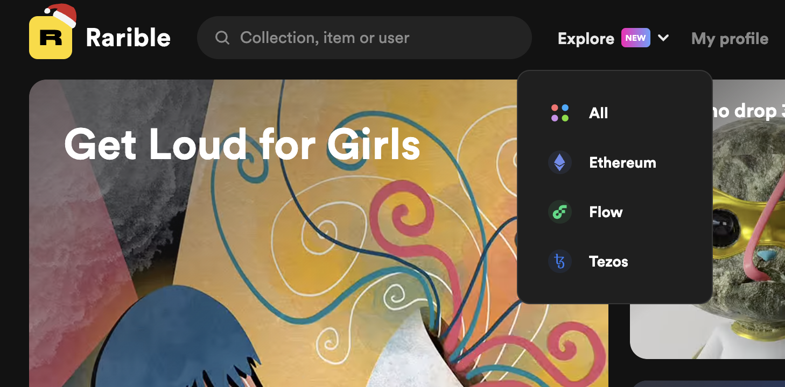
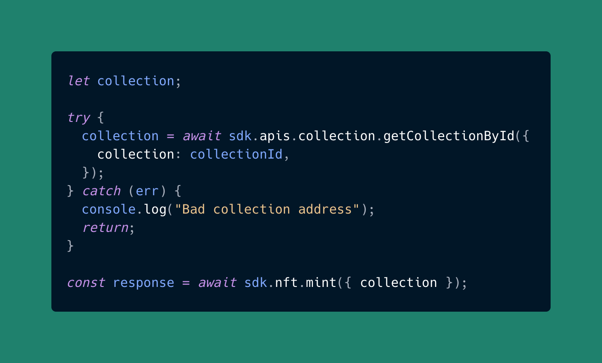
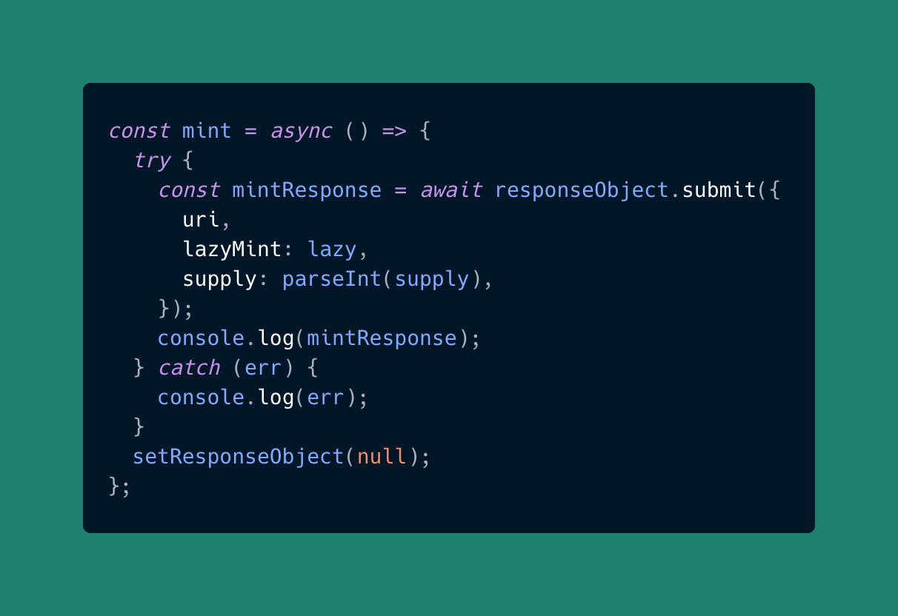

# How to create NFTs on Tezos Blockchain using Rarible Protocol?

What is Tezos blockchain, and how can you create NFTs on it? Main properties of Tezos are:

1. **Self-Amendment**

    In pursuit of a strong, united community, without the need for hard forks, they’ve created a self-amendment algorithm that basically adapts proposed changes step by step (of course, only the ones accepted by the community). The algorithm is very strong, error-resistant and what there are currently a lot of different proposals for improvements.

2. **Proof Of Stake**

    It is always nice to have a proof of stake mechanism: faster transactions, insanely low fees compared to PoW chains like Ethereum.

3. **Smart Contracts**

    Tezos native smart contract’s language is Michelson, which facilitates formal verification.

As you can see, Tezos is a pretty stable option.

## How to get funds in Tezos test wallet

Before we can mint an NFT, we actually need to have some sort of asset to spend. We use “faucets” for that. A Faucet is basically a software that can pour some crypto into your test account. You can find detailed instructions on how to do it [here](https://usual-20something-guy.medium.com/tezos-faucet-how-to-get-free-tezos-for-hangzhou-test-blockchain-36fd188515b7).

## Creating NFTs on Tezos, programmatically

To make everything done as quickly and efficiently as possible, we will use the **Rarible Protocol**. It allows you to create NFTs on a few blockchains right now, and one of them is Tezos (it also makes it very simple to do so). You can change your codebase from creating NFTs on Ethereum to Tezos in basically two lines.

On Rarible, we’ve created a [ready-to-code template](https://github.com/kolberszymon/union-sdk-template), with Next JS, Tailwind CSS, and already configured Rarible SDK, which you can just clone from GitHub and follow along. Since the code of the Union SDK (the one which is already set for you) is pretty complicated, we won’t dive into it in this article.

## App file

We start by wrapping the whole app in `SdkWalletConnecter` and `SdkContextProvider`. Additionally, we pick the desired wallet that we want to use in our project. Beacon is a provider that allows us to use Temple Wallet, which supports Tezos. 💡

<figure markdown>
{ width="800" }
</figure>

If you want to change the appearance of the “connect wallet” button, you can do it in `sdk-wallet-connector.tsx`, specifically using the **Options** function.

## Index File

<figure markdown>
{ width="800" }
</figure>

The Index File is responsible for creating the view shown above.

## Pass Collection ID

Collection ID is in a format called the “Union Address”. The Union Address is nothing more than the blockchain name in uppercase letters, followed by colon, followed by contract address. On most blockchain smart contracts there are accounts, just like any other, but with a few differences. They contain executable code. 👨‍💻

Examples of correct Union Addresses:

**ETHEREUM: 0x6ede7f3c26975aad32a475e1021d8f6f39c89d82**

**TEZOS: KT18vSGouhJcJZDDgrbBKkdCBjSXJWSbui3i**

When it comes to Rarible’s smart contract addresses, you can find most of them [here](https://docs.rarible.org/reference/contract-addresses/).

Unfortunately, some of them (e.g. Flow, Tezos) can change due to continuous development, so the best place to find the right one is on discord (Rarible Protocol). Just ping us there. 😉

For Tezos, the address of the smart contract on Hangzhounet’s test network is:

**KT18vSGouhJcJZDDgrbBKkdCBjSXJWSbui3i**

And you can see your test Tezos token by going to [https://rinkeby.rarible.com/](https://rinkeby.rarible.com/) and selecting the Tezos blockchain on the explore dropdown.

<figure markdown>
{ width="800" }
</figure>

## Pass Additional Parameters

<figure markdown>
{ width="800" }
</figure>

We use collection ID in order to determine a few things:

* If Union Address is correct
* If Lazy Mint is supported
* If Multiple Supply is allowed

You can look through the response object to see all the properties.

<figure markdown>
{ width="800" }
</figure>

## Submitting Response Object to the Blockchain

After filling in all the wanted properties, it’s time to submit the transaction.

<figure markdown>
{ width="800" }
</figure>

<figure markdown>
{ width="600" }
</figure>

## Summary

And that’s it! It’s really simple, to be honest. Now let’s take a look at what we have learned:

* What Tezos is and what is special about it.
* Where to find the ready-to-code GitHub template.
* How to create an NFT on Tezos blockchain.
