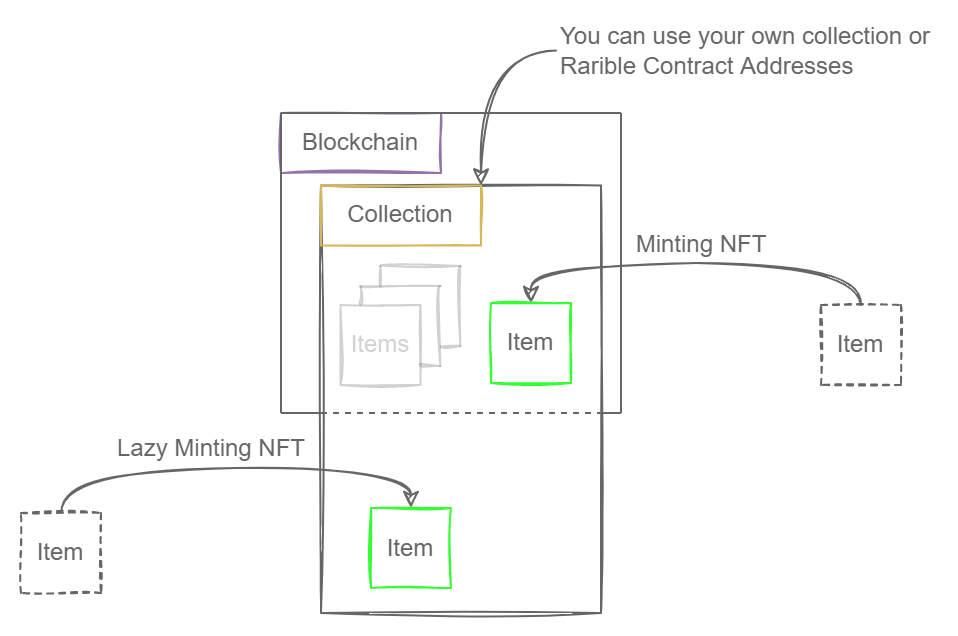

# Lazy Minting

In order to be able to fully understand what lazy minting is, and the benefits of doing so, we have to scratch the other aspects of blockchain and NFTs first. This document will touch three main aspects, which are crucial in a lazy minting process understanding:

1. Technical description of NFT
2. Minting
3. Lazy Minting

<figure markdown>
{ width="600" }
</figure>

## Technical description of NFT

If you're familiar with the concept of NFTs creation, feel free to skip this section.

NFT in its essence is just a variable in a Smart Contract code. The most common approach is as follows:

1. **Upload metadata** (image, description, attributes, etc.) to IPFS, which is a decentralized JSON-like database. If you ever used a NoSQL database like MongoDB or Firebase, that's basically that, only decentralized.

    Based on all the properties you've uploaded, a hash is calculated, by which you can now access your asset. Professionally, it's called URI, which stands for Unique Resource Identifier. Moreover, since storing image data on the blockchain would be expensive, instead of image data itself, you store an image URL in your NFT.

    The image itself can be stored on IPFS. Just not in the JSON you use for the NFT creation.

2. **Invoke a Smart Contract function** responsible for minting, and assign the URI created in the earlier step to your account address.

    That's it. Since the code on the blockchain is immutable, and we have a tokenId variable that tracks every unique NFT creation on a given smart contract, even if the same URI would be used twice, it will still be a different NFT.

## Minting

If you've read the first point, you've already had a quite good explanation of how the minting process works.

Minting can be described as a process of a write operation (it's an important fact, because if you're writing on the blockchain, you're paying a gas fee), which has one goal — associate an address of a creator with a tokenId, which points to token metadata URI on IPFS. Pardon those who thought that it is more complicated.

Of course, there are some language-specific restrictions and security steps that we have to take care of, but it's enough to use OpenZeppelin implementation of ERC721/ERC1155 to safely elevate core functionality, which in this case is NFT creation.

## Lazy Minting

The most important difference to point out between minting and lazy minting is **writing to the blockchain** action. As it was said before when writing to a blockchain occurs, the money from your wallet disappears i.e. you pay a gas fee.

In a normal minting, this process takes place immediately. In a lazy mint, it can be postponed to the first transfer action (mostly it will be a buy action).

How does that work under hood? There is some sort of off-chain database involved there. Basically, instead of immediately minting an NFT, the service stores its details in the off-chain database. In this way, it is able to properly display all the information like image, creator, etc.

When the first buy occurs, it is then minted straight to the buyer, but keeps all the information about an author or royalties. The benefits of that are obvious — you as the creator don't pay a gas limit. You get the same functionality without any cost.

You can then either lower the price of an NFT since the duty of gas payment lies on the buyer's side, or you can just get more money. The choice is yours.
